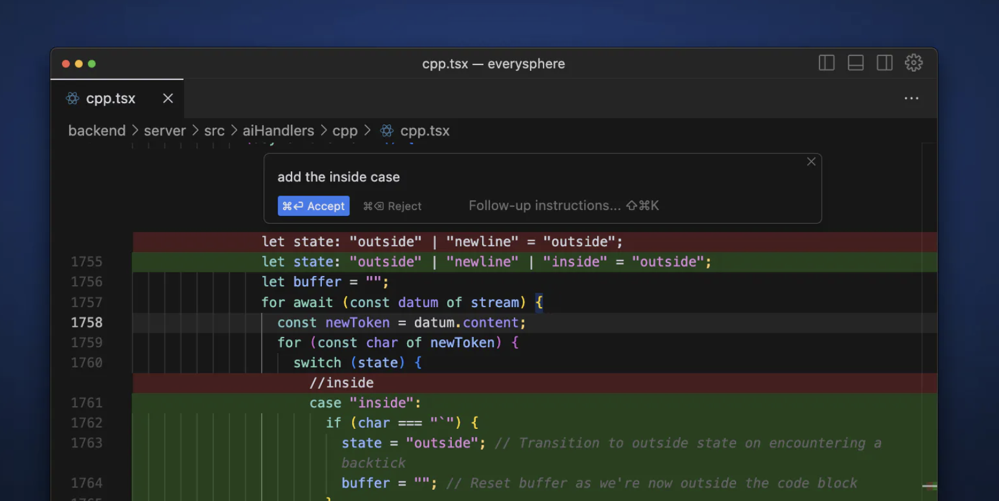
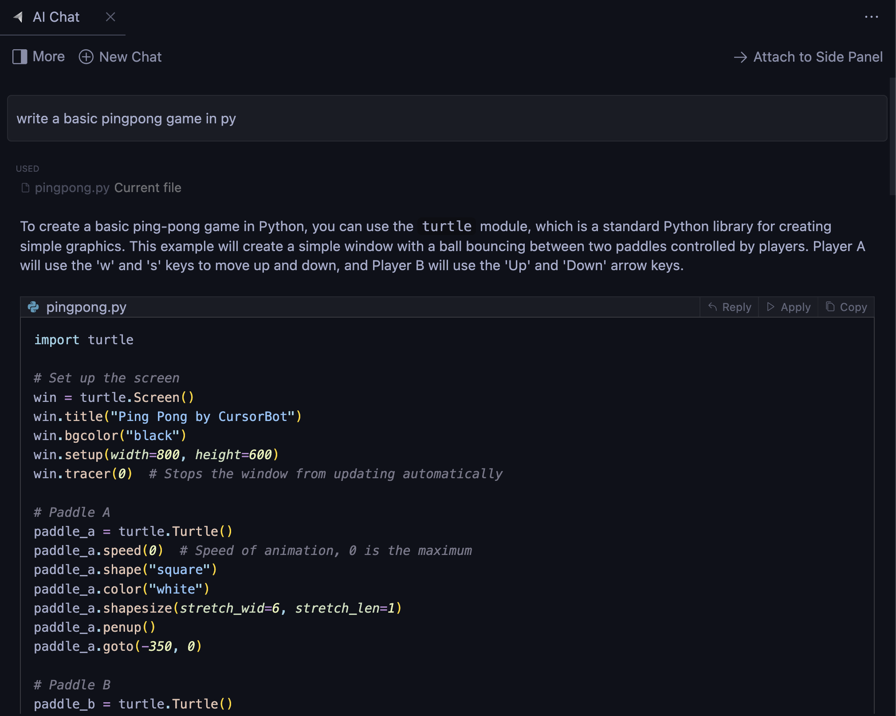

# Tutorials to Leverage Cursor Features

[Cursor](https://cursor.sh/features) is an AI-powered code editor designed to help developers build software faster and more efficiently. Below are tutorials to make the most out of Cursor's unique features.

## Command K

### Editing and Writing Code with AI
- **Basic Use**: Press `Command K` to start. To edit, select some code, click "Edit," and describe how the code should be changed. To generate completely new code, simply use `Command K` without selecting anything.

## Copilot++

### AI-Powered Autocomplete
- **Activation**: You can enable it on the lower status bar. It's a more powerful version of Copilot that can suggest mid-line completions and full diffs.

## Chat

### Direct Communication with AI
- **Interaction**: The chat can always see your current file and cursor, allowing you to ask specific questions about your code. Add specific code blocks to the context with `Command+Shift+L` or "@".

## @ Symbols and Codebase Responses

### Efficient Navigation and Queries
- **Using @ Symbols**: Allows you to easily show code to the AI for generating code with specific dependencies or asking about a file.
- **Codebase Responses**: Ask the AI about your entire codebase with `Command+Enter` to get specific answers.

## Docs

### Improved Understanding of Third-Party Libraries
- **Documentation Integration**: Enhances the AI's understanding of third-party libraries by using the command `@LibraryName`.

## Auto-Debug

### Automatic Debugging
- **Usage**: Activate automatic debugging after a terminal error so the AI can search for solutions through your files.

## Fix Lints

### Quick Lint Error Fixes
- **Instant Fixes**: Hover over any lint error and click the "Fix" button for quick corrections.

## Terminal Command K

### English Terminal Commands
- **Command Execution**: Write terminal commands in English using `Command K` for efficient execution of common tasks.

## Notes and Vision

### Quick Understanding and Visual Support
- **Notes**: Get quick summaries of unknown variables and types.
- **Vision**: Use images to provide visual context to the AI, useful for iterating on web UIs.

## Apply From Chat

### Quick Application of Code Suggestions
- **Suggestions Integration**: Apply code suggestions directly from the chat for quick integration into your editor.

## Rules for AI

### Code Style Customization
- **Setting Rules**: Specify style guidelines for the AI to maintain consistency in your codebase.

These tutorials are designed to help you fully leverage Cursor, enhancing your productivity and efficiency in software development.